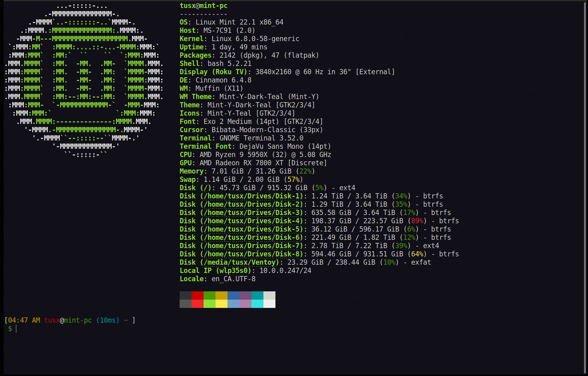

# My Custom Bashrc
### Requires `fastfetch` 

```
#===================================
# Bash Custmizations ===============
#===================================

function t_now {
    date +%s%3N
}

function t_start {
    t_start=${t_start:-$(t_now)}
}

function t_stop {
    local d_ms=$(($(t_now) - $t_start))
    local d_s=$((d_ms / 1000))
    local ms=$((d_ms % 1000))
    local s=$((d_s % 60))
    local m=$(((d_s / 60) % 60))
    local h=$((d_s / 3600))
    if ((h > 0)); then t_show=${h}h${m}m
    elif ((m > 0)); then t_show=${m}m${s}s
    elif ((s >= 10)); then t_show=${s}.$((ms / 100))s
    elif ((s > 0)); then t_show=${s}.$((ms / 10))s
    else t_show=${ms}ms
    fi
    unset t_start
}
set_prompt () {
t_stop
}

trap 't_start' DEBUG
PROMPT_COMMAND='set_prompt' 

PS1='\n[\[\e[33m\]\@ \[\e[31m\]\u\[\e[37m\]@\[\e[32m\]\h \[\e[36m\](${t_show}) \[\e[35m\]\W\[\e[m\] ] \n \[\e[0;32m\]$\[\e[m\] '

alias sysupgrade='sudo apt-get update && sudo apt-get upgrade -y && sudo apt-get autoremove -y && flatpak update -y'

#===========================
# Commands to run on New Shell
#===========================
fastfetch
```
