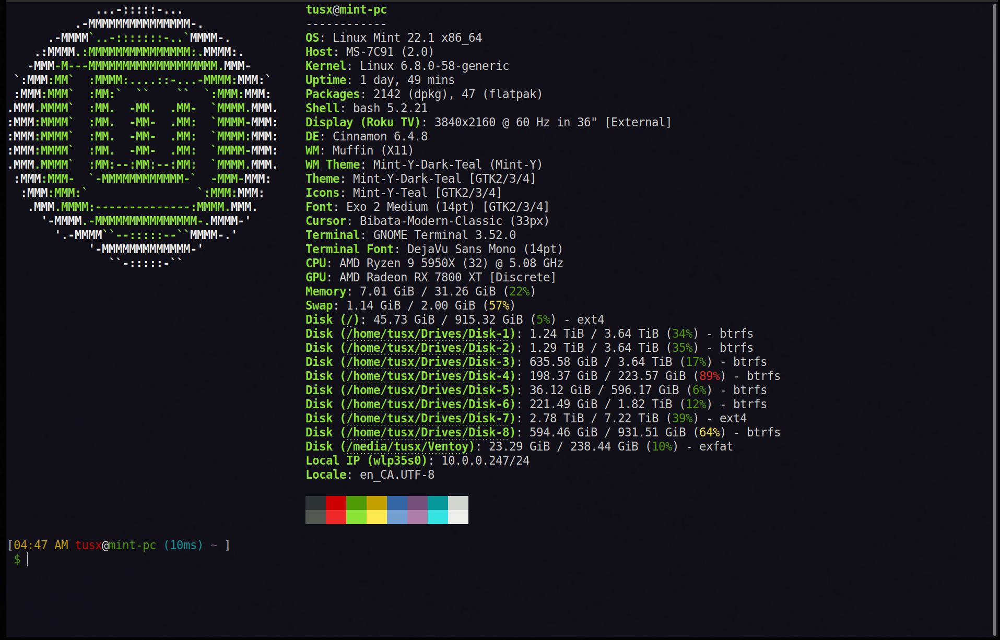

# My Custom Bashrc
### Uses `fastfetch` 
\

### .bashrc Code
```
#===================================
# .bashrc Custmizations ===============
#===================================
# ----- timer helpers -----

__prompt_timer_start=""
__prompt_timer_show="0ms"
__prompt_status_show="ok"

__prompt_now_ms() {
    if [[ -n ${EPOCHREALTIME-} ]]; then
        local sec usec
        IFS=. read -r sec usec <<< "$EPOCHREALTIME"
        printf '%d\n' "$((10#$sec * 1000 + 10#${usec:0:3}))"
    else
        date +%s%3N
    fi
}

__prompt_preexec() {
    case "$BASH_COMMAND" in
        __prompt_preexec|__prompt_precmd|__prompt_now_ms)
            return
            ;;
    esac

    # Start only once for the whole command line
    [[ -n $__prompt_timer_start ]] && return

    __prompt_timer_start="$(__prompt_now_ms)"
}

__prompt_precmd() {
    local exit_code=$?
    local now d_ms d_s ms s m h

    if [[ -n $__prompt_timer_start ]]; then
        now="$(__prompt_now_ms)"
        d_ms=$((now - __prompt_timer_start))
        d_s=$((d_ms / 1000))
        ms=$((d_ms % 1000))
        s=$((d_s % 60))
        m=$(((d_s / 60) % 60))
        h=$((d_s / 3600))

        if (( h > 0 )); then
            __prompt_timer_show="${h}h${m}m"
        elif (( m > 0 )); then
            __prompt_timer_show="${m}m${s}s"
        elif (( s >= 10 )); then
            __prompt_timer_show="${s}.$((ms / 100))s"
        elif (( s > 0 )); then
            __prompt_timer_show="${s}.$((ms / 10))s"
        else
            __prompt_timer_show="${d_ms}ms"
        fi
    else
        __prompt_timer_show="0ms"
    fi

    if (( exit_code == 0 )); then
        __prompt_status_show="ok"
    else
        __prompt_status_show="exit:${exit_code}"
    fi

    __prompt_timer_start=""
}

trap '__prompt_preexec' DEBUG
PROMPT_COMMAND='__prompt_precmd'

PS1='\n[\[\e[33m\]\@ \[\e[31m\]\u\[\e[37m\]@\[\e[32m\]\h \[\e[36m\]${__prompt_timer_show} \[\e[37m\]${__prompt_status_show} \[\e[34m\]jobs:\j hist:\! \[\e[35m\]\W\[\e[m\]]\n\[\e[0;32m\]\$\[\e[m\] '

#===========================
# Commands to run on New Shell
#===========================
fastfetch
```
